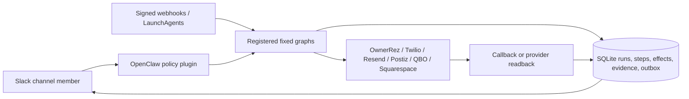

# SocialSol architecture

SocialSol is the AI operations platform for La Puesta del Sol Resort. It runs
on the Mac mini with OpenClaw as the Slack interface, fixed workflow graphs as
the execution boundary, and SQLite as the durable control plane. Runtime state
and credentials are mounted locally and are never committed.

The language model may choose a registered workflow and supply typed inputs. It
does not receive a generic provider mutation tool. Channel policy authorizes a
request before a run is created; the workflow then records every step, effect,
provider response, readback, and Slack notification.

## Workflow domains

| Domain | Trigger and action | Authoritative system |
|---|---|---|
| WhatsApp | Signed Twilio inbound/status callbacks and explicit Slack `!wa` replies | Twilio for delivery/read; CRM for the guest record |
| Social | Channel-authored content and scheduled Postiz publication | Postiz/provider readback plus the local content ledger |
| CRM flywheel | OwnerRez/Squarespace ingestion, Paulina prospecting, Regina re-engagement | CRM for leads/outreach; source provider for imported facts |
| Reservations | Occupancy reads, booking ingestion, and narrowly defined future mutations | OwnerRez |
| Accounting | Receipt intake, classification, Kapital reconciliation, QBO writes and reports | Kapital for bank activity; QBO for the books |
| Business intelligence | Cross-domain evidence-backed reads | Each named provider; never agent memory |

The workflows intentionally share one CRM schema, unsubscribe service, webhook
ingress, reporting layer, and secrets directory. They do not carry separate
copies of the customer database. See `workflow/README.md` for execution
invariants and `workflow/CUTOVER.md` for the shadow-to-live sequence.

## Repository boundaries

Committed:

- application and automation source
- landing pages and sanitized campaign/persona definitions
- database migrations and tests
- safe configuration examples
- portable LaunchAgent templates

Never committed:

- `.env`, provider tokens, signing secrets, or account identifiers
- CRM databases, customer exports, prospect lists, or warmup recipients
- campaign state, research results/cache, logs, reports, and generated media
- private agent identity, memory, or conversation files
- GoldRoute code or data

## Runtime control plane

External effects use stable idempotency keys where the provider supports them.
An effect is not called complete until the relevant callback or provider
readback proves it. Ambiguous non-idempotent boundaries fail for review instead
of being replayed blindly. Slack output is delivered through a durable outbox.

Channel membership grants only the capabilities listed for that stable channel
ID. High-risk capabilities can add a per-user restriction. OwnerRez writes use
a fixed 34-operation catalog plus a two-phase, same-user Slack confirmation,
precondition check, execute-once boundary, provider readback, and human
notification. Autonomous scheduled workflows use service identities and the
same fixed graphs, evidence rules, and write notifications.

`#whatsapp` is the only human WhatsApp surface. Signed Twilio inbound messages
are durably queued into that channel before acknowledgement, and only explicit
`!wa` messages in the matching Slack thread may invoke `whatsapp.reply`. Twilio
callbacks update and post the exact queued/sent/delivered/read/failed state;
neither the model nor initial send acceptance can infer delivery or viewing.

`SOCIALSOL_ROOT`, `SOCIALSOL_SECRETS_DIR`, and `DB_PATH` define the deployment
location. Source code must not assume a username, home directory, Slack ID, or
legacy `marketing-stack` path.
