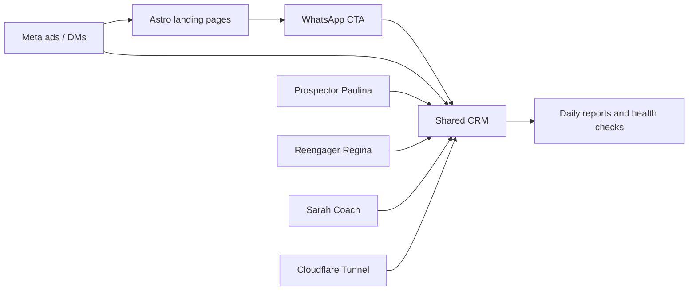

# Resort marketing architecture

SocialSol is the single source repository for La Puesta del Sol Resort's
marketing and guest-conversion automation. Runtime state and credentials are
mounted locally and are never committed.

## Workflows

| Workflow | Source | Conversion or action | System of record |
|---|---|---|---|
| Social/Meta | Meta ads, organic posts | Landing page → WhatsApp or Meta DM | `crm/` |
| Prospector Paulina | Public web research | Compliant outbound email | `prospector/` + `crm/` |
| Reengager Regina | Past guests and prior inquiries | Resend email or manual channel handoff | `regina/` + `crm/` |
| Sarah Coach | Inbound guest reply | Suggested human response and outcome capture | `sarah-coach/` + `crm/` |
| Sender warmup | Private allow-listed recipients | Controlled Resend traffic | `warmup/` |

The workflows intentionally share one CRM schema, unsubscribe service, webhook
ingress, reporting layer, and secrets directory. They do not carry separate
copies of the customer database.

## Repository boundaries

Committed:

- application and automation source
- landing pages and sanitized campaign/persona definitions
- database migrations and tests
- safe configuration examples
- portable LaunchAgent templates

Never committed:

- `.env`, provider tokens, signing secrets, or account identifiers
- CRM databases, customer exports, prospect lists, or warmup recipients
- campaign state, research results/cache, logs, reports, and generated media
- private agent identity, memory, or conversation files
- GoldRoute code or data

## Runtime dependencies

`SOCIALSOL_ROOT`, `SOCIALSOL_SECRETS_DIR`, and `DB_PATH` define the deployment
location. Source code must not assume a username, home directory, Slack ID, or
legacy `marketing-stack` path.
