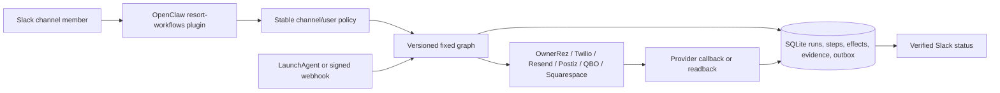

# Durable workflow architecture

SocialSol uses a small, fixed graph system on the Mac mini. OpenClaw remains
the conversational interface, SQLite is the durable control plane, and each
external provider remains authoritative for its domain.

## Invariants

1. The model may select only a registered workflow. It cannot submit a shell
   command, impersonate a Slack user, or invent a channel ID.
2. Every triggering Slack event has an idempotency key. Every external effect
   has a separate idempotency key and a request hash.
3. An external mutation is complete only after provider readback. Provider
   acceptance is not delivery, and delivery is not reading.
4. A worker owns a step lease. Stale idempotent steps can be resumed;
   ambiguous non-idempotent Twilio or OwnerRez boundaries fail for human review
   instead of sending or mutating twice.
5. Incoming Twilio and OwnerRez webhooks are acknowledged only after the event
   and its processing intent are durable.
6. Slack notifications use an outbox. A temporary Slack outage cannot erase an
   inbound WhatsApp message or a write notification.
7. Agent memory is never used as proof of occupancy, cash, message delivery,
   direct charges, or campaign output.

## Authorities

| Fact | Authority | Local role |
|---|---|---|
| Availability, occupancy, bookings | OwnerRez | Evidence cache and CRM contact sync |
| Direct charges and fees | Squarespace | Commerce read model |
| Bank cash and books | Kapital and QBO | Classified transaction and report read models |
| Leads, campaigns, outreach | CRM | Operational source of truth |
| WhatsApp acceptance/delivery/read | Twilio callbacks | Message ledger and exact status |
| Social scheduling/publication | Postiz/provider readback | Content ledger |

## Workflow families

- WhatsApp: signed inbound storage, durable Slack outbox, resumable CRM lead
  enrichment, explicit `!wa` send, and callback-driven
  queued/sent/delivered/read states. `#whatsapp` is the sole human send surface;
  the former direct HTTP send routes are retired.
- Reservations: authoritative OwnerRez reads and a fixed 34-operation mutation
  catalog. Every write requires a durable proposal, exact same-user Slack
  confirmation within 15 minutes, a fresh precondition check, execute-once
  semantics, operation-specific provider readback, and human notification.
- Lead flywheel: OwnerRez and Squarespace source sync, CRM pipeline reads,
  Paulina and Regina sends with CRM/Resend readback.
- Social: channel-owned content records plus routine or selected Postiz
  publishing. Approved rows are dispatched shortly before their scheduled time;
  scheduled/publishing remain distinct from published.
- Accounting: receipt ingestion scoped to its Slack channel, human/agent
  annotation, Kapital classification, deterministic reconciliation, and
  auto-tier QBO writes with `requestid` plus entity readback.
- Business intelligence: cross-domain read graphs query named authorities and
  explicitly say when occupancy, cash, or another mutable fact was not queried.

Runtime policy is copied from `policy.example.json` to the ignored
`policy.json`. See `CUTOVER.md` for deployment sequencing.
