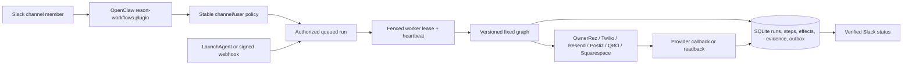

# Durable workflow architecture

SocialSol uses a small, fixed graph system on the Mac mini. OpenClaw remains
the conversational interface, SQLite is the durable control plane, and each
external provider remains authoritative for its domain.



## Invariants

1. The model may select only a registered workflow. It cannot submit a shell
   command, impersonate a Slack user, or invent a channel ID.
2. Every triggering Slack event has an idempotency key and input hash. Reusing
   a key with different input fails closed. Every external effect has a
   separate idempotency key and request hash.
3. Every effect declares its verification contract. OwnerRez, QBO, and Postiz
   require provider readback; Meta DM terminates at recorded provider
   acceptance; WhatsApp retains optional callback-driven delivery/read facts.
   Provider acceptance is never presented as delivery, and delivery is never
   presented as reading.
4. The HTTP control plane authorizes and queues; workers alone execute. A
   worker lease has a heartbeat and fencing token, so an expired worker cannot
   commit over its replacement. Stale idempotent steps can be resumed;
   ambiguous non-idempotent Twilio, Meta, Postiz, Resend, or OwnerRez boundaries
   fail for human review instead of sending or mutating twice. Crash recovery
   is chosen from the active step's effect class, so an expired read or local
   projection can be retried without creating a false external-effect review.
5. Incoming Twilio and OwnerRez webhooks are acknowledged only after the event
   and its processing intent are durable.
6. Slack notifications use an outbox. A temporary Slack outage cannot erase an
   inbound WhatsApp message or a write notification.
7. Agent memory is never used as proof of occupancy, cash, message delivery,
   direct charges, or campaign output.
8. Shadow policy is enforced inside the engine at each effect boundary. Reads,
   local writes, and internal notifications are distinct from external
   idempotent, non-idempotent, and guest-message effects. Exact always-on
   exceptions are named as `workflow:step` policy entries.

## Authorities

| Fact | Authority | Local role |
|---|---|---|
| Availability, occupancy, bookings | OwnerRez | Evidence cache and CRM contact sync |
| Direct charges and fees | Squarespace | Commerce read model |
| Bank cash and books | Kapital and QBO | Classified transaction and report read models |
| Leads, campaigns, outreach | CRM | Operational source of truth |
| WhatsApp acceptance/delivery/read | Twilio callbacks | Message ledger and exact status |
| Social scheduling/publication | Postiz/provider readback | Content ledger |

## Workflow families

- WhatsApp: signed inbound storage, durable Slack outbox, resumable CRM lead
  enrichment, explicit `!wa` send, and callback-driven
  queued/sent/delivered/read states. `#whatsapp` is the sole human send surface;
  the former direct HTTP send routes are retired. Its model-facing control-plane
  tool includes read-only consolidated CRM contact lookup, so authorized members
  can retrieve full POCs and historical WhatsApp identities without leaving the
  channel; the model-facing tool still cannot invoke a send.
- Meta DMs: the former loopback HTTP sender is retired. Instagram/Facebook
  replies use `!dm <dm-id> <message>` in `#social-sol`, a command-only durable
  workflow, and provider acceptance is never presented as delivery.
- Sarah messages: the five-minute Gmail ledger projects every new mailbox
  message into `#sarah-email`, while OwnerRez `thread_message` webhooks project
  Airbnb/Vrbo messages through the same ledger. Each provider conversation has
  one Slack root. `!email reply` is intercepted before the model and follows an
  immutable same-user/same-thread confirmation path; Gmail and OwnerRez sends
  each require exact provider readback. Direct replies Sarah sends outside
  Slack are captured into the original thread. `email.activity.read` is the
  live, read-only Gmail authority for recent/received/sent/unread questions in
  both `#sarah-email` and the broad-read `#business-intel` channel; its result
  states live mailbox counts and ledger projection coverage separately.
- Paid media: `marketing.snapshot.read` records live Meta delivery, exact CRM
  conversions, tracking health, and the only bounded actions available to
  autonomy. Evidence must cover at least three completed local days; daily
  one-day reports are informative only. `meta.campaign.autonomous` accepts an
  exact unexpired pause or budget decrease, never an increase, and permits one autonomous campaign
  mutation per 24 hours. Paused provisioning, activation, increases, and
  landing variant changes use `marketing.change.propose` followed by the same
  authorized user issuing the 15-minute `!meta confirm` command. That path also
  permits a human-requested pause when bounded evidence is not the reason for
  the change. The immutable request, committed brief, provider preflight,
  effect, and readback all have
  durable hashes/evidence. `marketing.report.daily` and `meta.audience.sync`
  are graph-owned scheduled jobs whose Slack notifications use the outbox;
  audience state and a hash-verified campaign-registry recovery snapshot are
  stored inside the encrypted-backup CRM database. Campaigns without a
  committed brief fail closed for autonomous mutations.
- Creative/landing review invariant: `campaign_activate` refuses to run —
  in preflight, on every path including the CLI — unless the registry row
  carries a human Slack approval receipt whose `brief_hash` equals the hash of
  the current committed brief (lifecycle fields `status`/`activated_at`
  excluded), recorded via `automation/campaign_approval.py record`. Editing
  the brief after review invalidates the receipt. `landing_status → live`
  likewise requires a receipt recorded with `record-landing` that hashes the
  variant's exact current `config`; content edits stale the receipt. A
  post-activation readback that finds configuration drift rolls the campaign
  back to PAUSED before opening manual review.
- Per-operation autonomy: proposals auto-dispatch their confirmation only when
  the runtime policy lists `marketing.change.confirm` in
  `autonomous_workflows` AND names the proposal's exact operation in
  `autonomous_operations["marketing.change.confirm"]` (see
  `policy.example.json`). Absent either entry the proposal waits for the human
  `!meta confirm`. The review invariant above still gates activation inside
  the auto-dispatched confirmation, so arming never bypasses review.
- Reservations: authoritative OwnerRez reads and a fixed 34-operation mutation
  catalog. Every write requires a durable proposal, exact same-user Slack
  confirmation within 15 minutes, a fresh precondition check, execute-once
  semantics, operation-specific provider readback, and human notification.
- Lead flywheel: OwnerRez and Squarespace source sync, CRM pipeline reads,
  Paulina's run-scoped analysis/research/verification/composition preparation,
  Paulina and Regina sends with stable Resend idempotency keys, CRM/Resend
  readback, exact workflow-run attribution, and ambiguous-effect pausing
  instead of whole-script replay. Resend retains an idempotency key for 24
  hours; the durable CRM send status remains the longer-lived replay guard.
- Social: channel-owned content records plus routine or selected Postiz
  publishing. Approved rows are dispatched shortly before their scheduled time;
  scheduled/publishing remain distinct from published.
- Accounting: receipt ingestion scoped to its Slack channel, human/agent
  annotation, Kapital classification, deterministic reconciliation, and
  auto-tier QBO writes with `requestid` plus entity readback.
- Business intelligence: cross-domain read graphs query named authorities and
  explicitly say when occupancy, cash, or another mutable fact was not queried.

Runtime policy is copied from `policy.example.json` to the ignored
`policy.json`. See `CUTOVER.md` for deployment sequencing.

## Ambiguous-result review

If a non-idempotent provider request loses its response—or provider acceptance
is recorded but its local projection repeatedly fails—the workflow opens a
`manual_review` and the channel receives a durable outbox notification. The
provider step and retryable local projection are separate graph nodes, so a
local retry cannot resend. The configured human reviewers inspect the provider
console and resolve it with one exact command:

- `!review resolve <review-id> sent <provider-id>`
- `!review resolve <review-id> not-sent`
- `!review resolve <review-id> abandon`

The create-run gate applies to HTTP, worker, dispatcher, and child-graph entry
points. Until resolution, new mutations for that workflow are rejected. Guest
messaging workflows additionally serialize active sends, preventing a second
command while a post-acceptance projection is retrying. Review resolution and
its effect/evidence transition are one atomic transaction; a conflicting
second resolution receives a conflict and changes nothing. Resolution is
evidence, not permission to claim delivery or read status.

A run started without a channel — every scheduled graph — has no thread to
post into, so the notice falls back to the first `write_notifications` channel
that the policy also binds under `channels`. When nothing resolves, the review
is still opened and a `manual_review_unnotified` event is written against the
run, so an unannounced review is attributable instead of silent.

## Policy changes

`workflow/policy.json` is runtime state, not tracked in Git, so a hand edit
leaves no trace the checkout guard can see. The sanctioned path is: copy the
current file aside → build the candidate → validate it with `validatePolicy`
→ review the diff → install atomically at mode 600 → record the fingerprint:

```bash
node scripts/policy-fingerprint.js record --note "<why this changed>"
```

`node scripts/policy-fingerprint.js check` compares the installed file against
that record and exits nonzero on drift; `release:check` reports the same
status, and the health monitor carries it as `runtime_policy_unrecorded`
(reported, not paging — a five-minute job must not alarm forever because a
legitimate install skipped the record step). The record holds a hash, never
policy content. The server picks up an installed policy by mtime and the
worker reads it fresh per step, so no restart is required.

## Operational thresholds

The health monitor fails closed when a queued run is older than one minute, a
retry is overdue by five minutes, a pending outbox row is older than five
minutes, a readback-required effect misses its deadline, a provider request
remains unaccepted for fifteen minutes, a lease expires, an outbox row is dead,
or a manual review is open. Provider-acceptance and callback-optional effects
do not create permanent false alarms after successful acceptance. Missing
schema migrations, Slack alert configuration, runtime processes, or a running
process whose loaded source predates checkout edits are also unhealthy.
Live paid-media report and audience-sync graphs must each have a completed run
within 30 hours, and their LaunchAgents must remain loaded.
